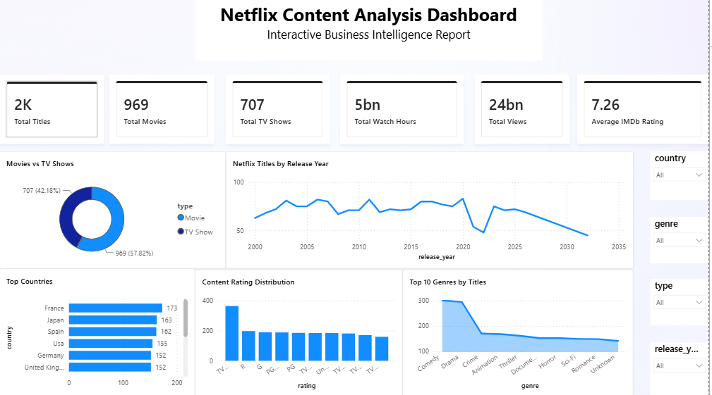

# 🎬 Netflix Content Analysis Dashboard

> An end-to-end Business Intelligence project that analyzes Netflix content using Microsoft Excel, Power Query, Power BI, and DAX to generate interactive dashboards and business insights.

---

## 📖 Description

This project analyzes Netflix content using Power BI.

The dashboard provides insights into Movies, TV Shows, Genres, Countries, Ratings, Release Trends, IMDb Ratings, Views, and Watch Hours to support business decision-making.

---

## 🎯 Project Objective

- Analyze Netflix content data.
- Clean and transform raw data.
- Build an efficient Power BI data model.
- Create interactive dashboards.
- Develop DAX measures and KPIs.
- Generate business insights and recommendations.

---

## 🛠 Tools Used

- Microsoft Excel
- Power Query
- Microsoft Power BI
- DAX
- Data Modeling
- Data Visualization

---

## 📂 Dataset

- **Dataset:** Netflix Content Dataset
- **Domain:** Entertainment
- **Format:** Excel (.xlsx)
- **Status:** Cleaned and Transformed

---

## 📊 Dashboard Preview

> Upload your dashboard screenshot inside the **images** folder.

```markdown

```

---

## 📈 Key Performance Indicators (KPIs)

- Total Titles
- Total Movies
- Total TV Shows
- Average IMDb Rating
- Total Views
- Total Watch Hours
- Distinct Countries
- Distinct Genres

---

## ❓ Business Questions

- How is the Netflix content library distributed between Movies and TV Shows?
- Which genres contribute the most content?
- Which countries contribute the most content?
- How has the Netflix content library evolved over time?
- What are the most common content ratings?
- Which genres have the highest average IMDb ratings?
- Which directors contribute the largest number of titles?
- Which regions generate the highest watch hours?
- What insights can support future content strategy?

---

## 💡 Business Insights

- Movies represent the majority of the Netflix content library.
- Drama is one of the most popular genres.
- The United States contributes the highest number of titles.
- Most Netflix content has been released after 2015.
- High watch-hour regions indicate stronger audience engagement.
- Highly rated genres provide opportunities for future investment.
- Interactive dashboards simplify business reporting and analysis.

---

## 🛠 Skills Demonstrated

- Data Collection
- Data Understanding
- Data Profiling
- Data Cleaning
- Data Transformation
- Power Query
- Data Modeling
- DAX Calculations
- KPI Development
- Dashboard Design
- Data Visualization
- Business Analysis
- Business Intelligence
- Report Development

---

## 📄 Project Documentation

The complete project documentation is available in the **docs** folder.

### Documentation

- [Project Overview](docs/01_Project_Overview.pdf)
- [Data Collection & Understanding](docs/02_Data_Collection_and_Understanding.pdf)
- [Excel Data Quality Assessment](docs/03_Excel_Data_Quality_Assessment.pdf)
- [Power Query Data Cleaning & Transformation](docs/04_Power_Query_Data_Cleaning_and_Transformation.pdf)
- [Power BI Data Model](docs/05_Power_BI_Data_Model.pdf)
- [DAX Measures & KPIs](docs/06_DAX_Measures_and_KPIs.pdf)
- [Dashboard Design & Visualization](docs/07_Dashboard_Design_and_Visualization.pdf)
- [Business Questions & Insights](docs/08_Business_Questions_and_Insights.pdf)
- [Business Recommendations](docs/09_Business_Recommendations.pdf)
- [Final Project Report](docs/10_Final_Project_Report.pdf)

---

## 📁 Repository Structure

```text
netflix-content-analysis/
│
├── README.md
├── Netflix_Content_Analysis_Dashboard.pbix
├── Cleaned_Netflix_Dataset.xlsx
│
├── images/
│   └── dashboard.png
│
└── docs/
    ├── README.md
    ├── 01_Project_Overview.pdf
    ├── 02_Data_Collection_and_Understanding.pdf
    ├── 03_Excel_Data_Quality_Assessment.pdf
    ├── 04_Power_Query_Data_Cleaning_and_Transformation.pdf
    ├── 05_Power_BI_Data_Model.pdf
    ├── 06_DAX_Measures_and_KPIs.pdf
    ├── 07_Dashboard_Design_and_Visualization.pdf
    ├── 08_Business_Questions_and_Insights.pdf
    ├── 09_Business_Recommendations.pdf
    └── 10_Final_Project_Report.pdf
```

---

## 🚀 Future Enhancements

- Integrate live streaming data.
- Add subscription and revenue analysis.
- Implement predictive analytics.
- Automate scheduled data refresh.
- Add drill-through and drill-down reports.
- Enhance dashboard performance.

---

## 📬 Contact

**Shanmukh Koyya**

📧 Email: <shanmukhkoyya1234@gmail.com>

💼 LinkedIn: [Shanmukh Koyya](https://www.linkedin.com/in/shanmukh-koyya/)

---

## ⭐ Support

If you found this project useful, please consider giving this repository a **⭐ Star** on GitHub.
